# 基于SpringBoot学生宿舍管理微信小程序-毕业设计

# 获取地址

#### 作者QQ：3275035005 微信：xkbishe123 (支持修改、 部署调试、 代做接毕业设计和课程设计)

#### 网站建设、小程序、H5、APP、各种系统、样式修改、10000套源码可选。

#### 选题+开题报告+任务书+程序定制+安装调试+论文+答辩ppt 都可以做

#### 问题包修改，包满意，有需求尽管甩过来！一条龙帮你安心过！

#### 所有项目以及源代码本人均调试运行无问题 可支持远程调试运行

# 项目介绍
基于基于SpringBoot学生宿舍管理微信小程序-毕业设计，本系统分微信小程序和管理后台两部分，项目采用前后端分离

### 1. 用户：

 		用户登录注册、查看充电站、充电站搜索、 查看订单记录、 充电桩订单预约 、查看钱包、 余额充值、 修改个人资料、 查看收藏充电站、 提交异常反馈、 查看异常反馈、 退出登录

###  2. 充电站管理员：

充电站信息：分页查询、新增、修改、删除 

充电桩信息：分页查询、新增、修改、删除 

订单信息：分页查询、删除 

数据统计管理：查询 

个人中心：修改 密码修改 退出登录

### 3. 系统管理员：

充电站信息：分页查询、新增、修改、删除 

充电桩信息：分页查询、新增、修改、删除 

订单信息：分页查询、删除 

预约充电信息：分页查询、删除 

用户信息管理：分页查询、新增、修改、删除 

系统公告管理：分页查询、修改 

用户反馈管理：分页查询、处理反馈、删除 

数据统计管理：查询 

个人中心：修改 密码修改 退出登录

# 技术框架
- 开发语言：Java 
- 数据库：Mysql 
- 系统环境：jdk8、maven、node
- 后端框架：SpringBoot、MyBatisplus、MyBatis
- 前端框架：Vue、Elementui、微信小程序
- 工具：IDEA、Navicat、HBuilder、微信开发者工具
- 技术架构：前后端分离、B/S架构、MVC架构
# 项目截图

### 1. 微信端

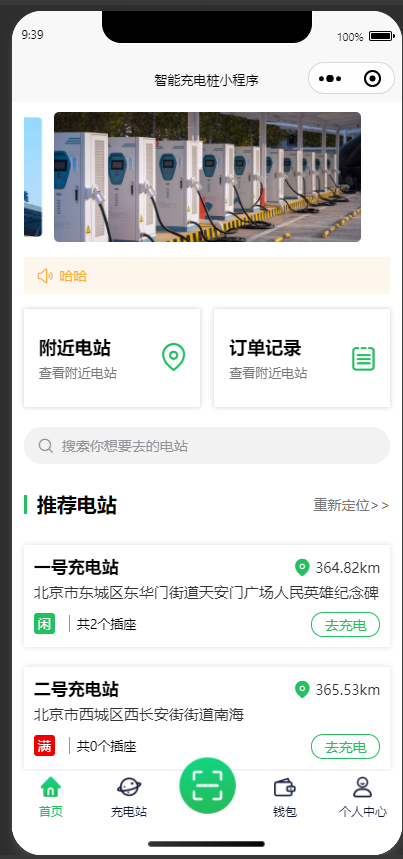

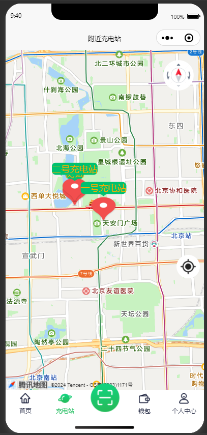

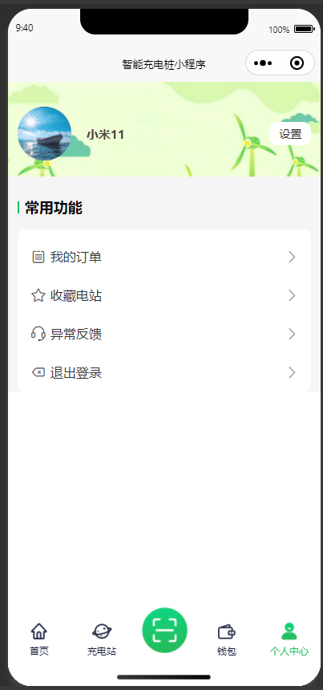

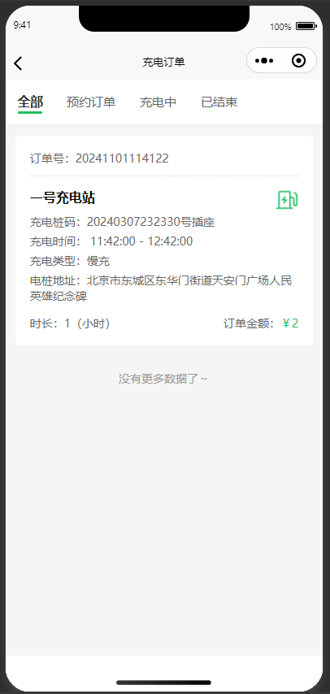

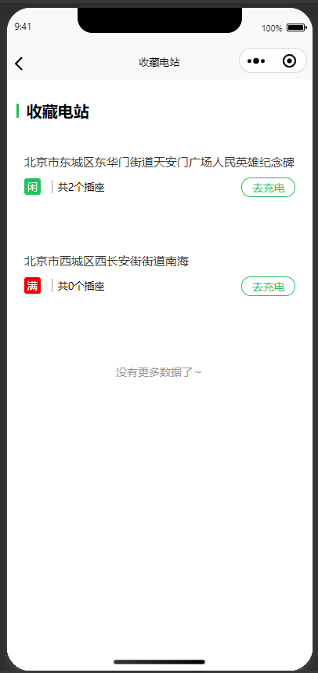

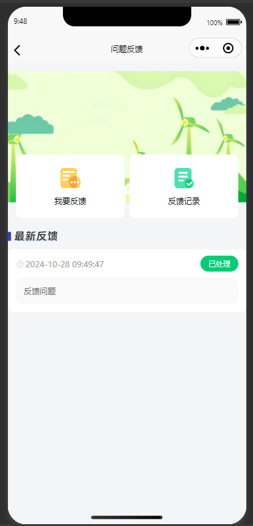

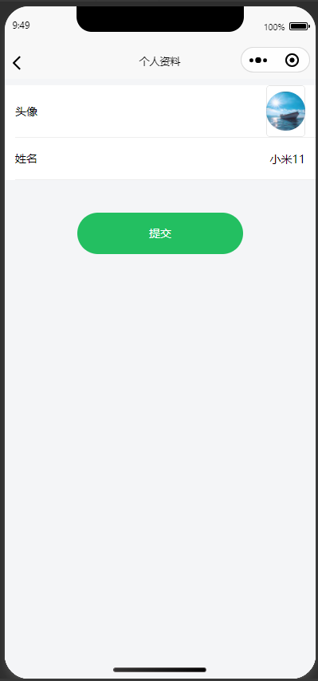

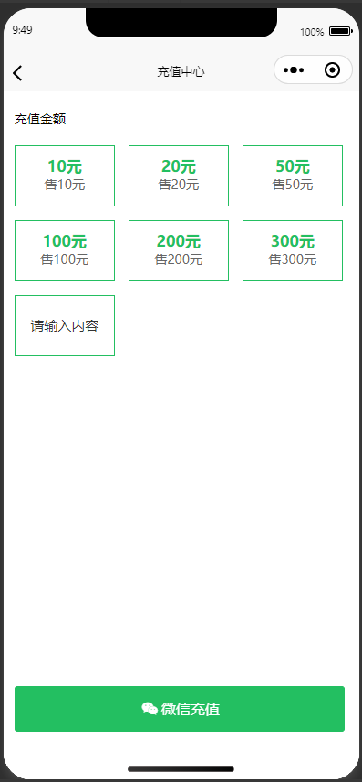

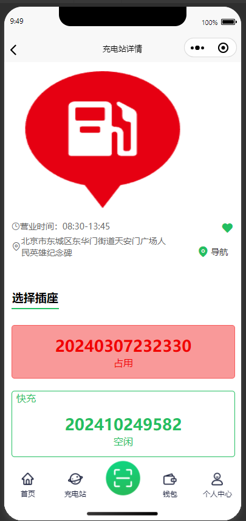

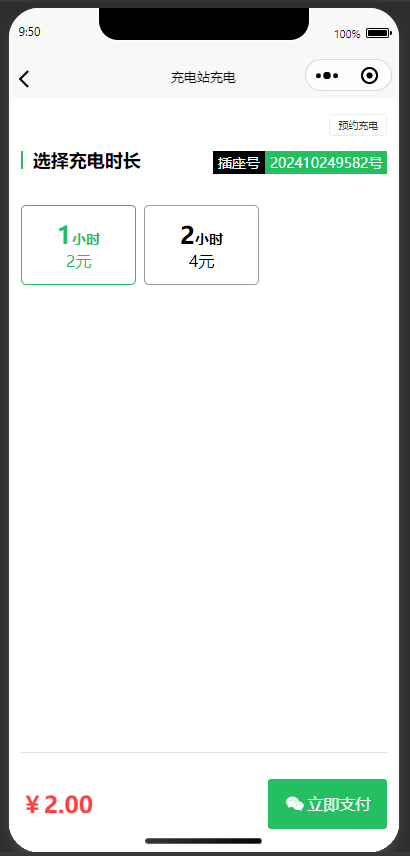

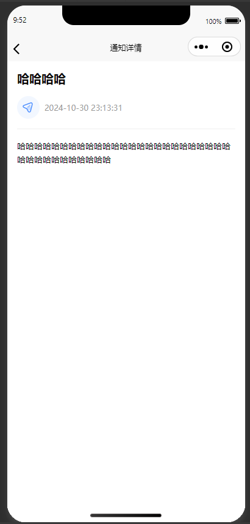

### 2. 管理端

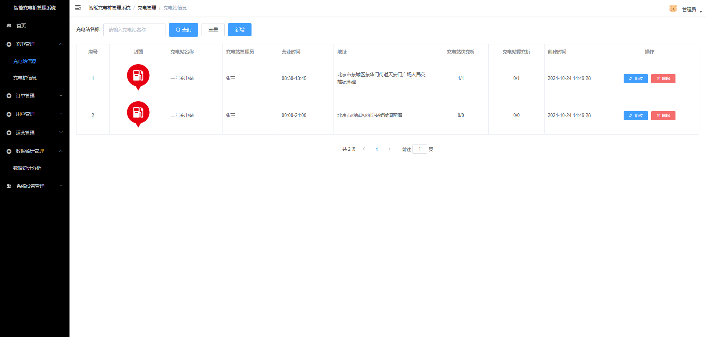

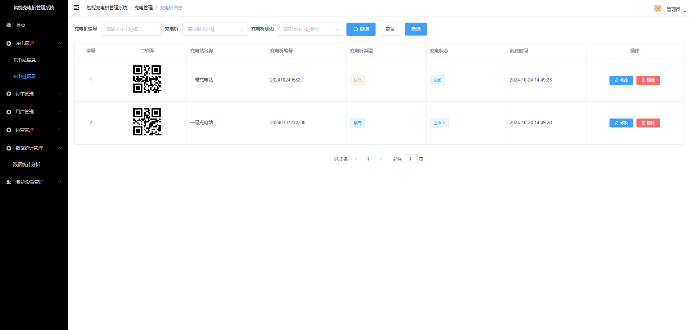

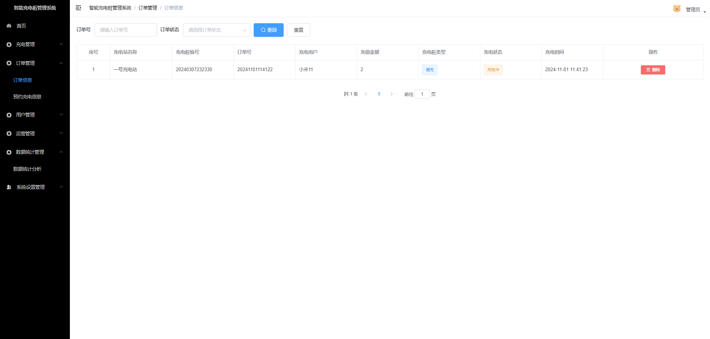

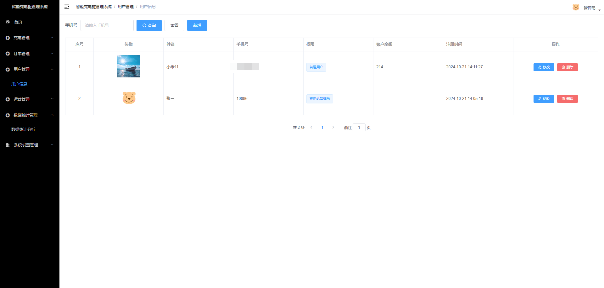

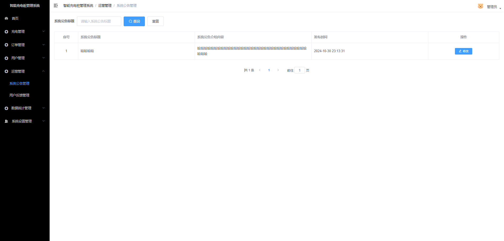

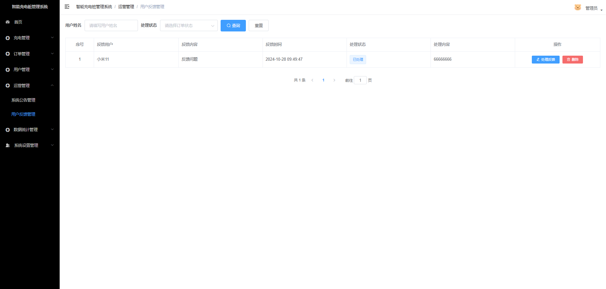

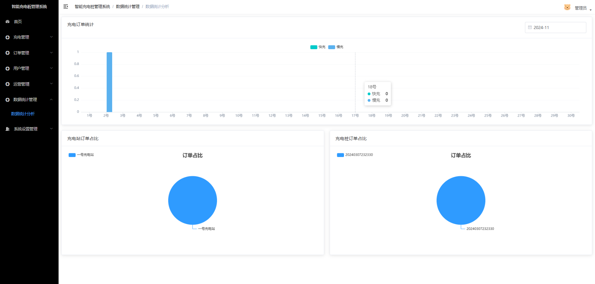

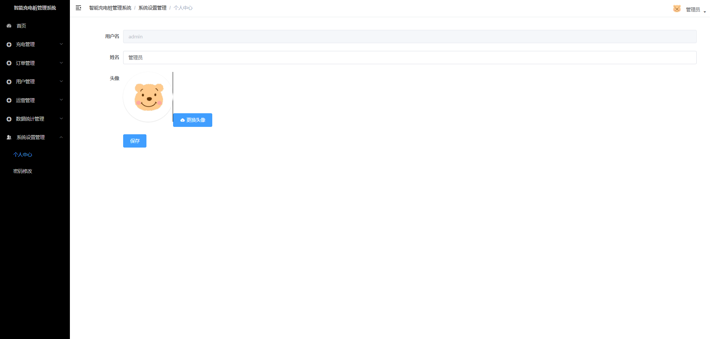

